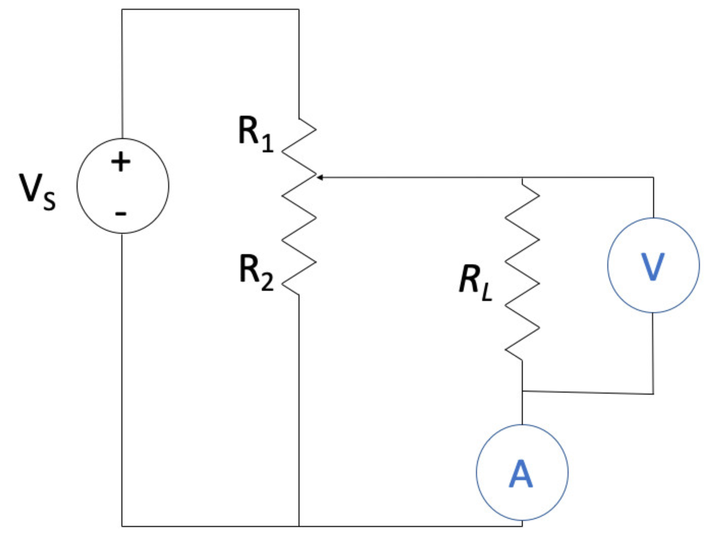

# Synchronous-computing-electrical-circuits

Example demonstrating the use of [Asynchronous I/O](https://docs.python.org/3/library/asyncio.html), applied to Voltmeter and Ammeter measurements in variable resistance circuits

At the beginning (t1=0s) the resistances are R1 = 0 Ω and R2 = 100 kΩ. These two resistances change linearly so that after 10 seconds (t2 = 10 s) they are R1 = 100 kΩ
and R2 = 0 Ω.

RL=30kΩ.

Class implementation to :
  record and print voltmeter reading every 100 ms & ammeter every 300 ms.
  record and print the value of RL every 1000 ms.
  record and print the rolling average for RL, over the last 2000 ms
  
Total run time = 10 s
